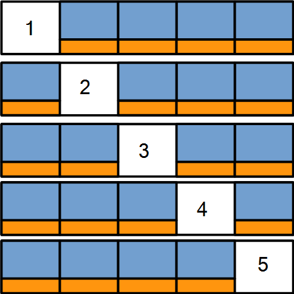

```{r setup, include=FALSE}
knitr::opts_chunk$set(echo = TRUE, warning = FALSE, message = FALSE)
```

## Introduction
In [Part 3](http://rpubs.com/mszczepaniak/predictkbo3model), we built the model used to make predictions, but we had arbitrarily chosen values for the two parameters in the model which were the discount rates at the bigram and trigram levels: $\gamma_2$ and $\gamma_3$.  In the final installment of this 4-part series, we'll determine good values for these discount rates using 5-fold cross-validation on the training partitions of the Blogs corpus.  After selecting the best looking values, we'll conclude the analysis with an accuracy estimate using the held out test set.

## K-Fold Cross-Validation
In their book [*An Introduction to Statistical Learning* [1]](http://www-bcf.usc.edu/~gareth/ISL/) James, Witten, Hastie, and Tibshirani describe K-Fold Cross-Validation as follows:

*This approach involves randomly dividing the set of observations into k groups, or **folds** of approximately equal size.  The first fold is treated as a validation set, and the method is fit on the remaining k - 1 folds.*  

A good way to start understanding this approach is to first visualize breaking the data into k roughly equal partitions.  In our case k=5, so we can use the picture below to illustrate the process.  



### Cross-Validation Alogrithm
Note: Unless mentioned otherwise, all code referred to in this document is listed in the **Appendix**.

#### Step 1 - Make the Folds

Each fold is represented as one of the five rows shown in the picture above.  Random indices for lines in the **blogs** corpus were selected using the **makeFolds** function and resulted in the following files:

[fold_1blogs.txt](https://www.dropbox.com/s/fo7ybvw4h7de2e8/fold_1blogs.txt?dl=1)  
[fold_2blogs.txt](https://www.dropbox.com/s/ufnm970okjwqi7j/fold_2blogs.txt?dl=1)  
[fold_3blogs.txt](https://www.dropbox.com/s/lzbg2zuixhcwzev/fold_3blogs.txt?dl=1)  
[fold_4blogs.txt](https://www.dropbox.com/s/cxt7bmjd5qebhkr/fold_4blogs.txt?dl=1)  
[fold_5blogs.txt](https://www.dropbox.com/s/cl3ifhr5hjercuy/fold_5blogs.txt?dl=1)  

#### Step 2 - Partition the Folds

In each fold there are 3 partitions.  The first partion is the **validation set** depicted by the white box in each fold (20% of the data in a fold).  The indices for the vaildation partion were generated using the **readFolds** function.

The remaining data non-validation data is partitioned into two groups: 1) the **training set** (80% of the non-validation data) depicted as the blue boxes and 2) the **test set** (20% of the non-validation data) depicted as the gold boxes.  These partitions were created from the indices generated using the **makeTrainTestNV** function.  The resulting files are listed in the table below.

Fold | Blogs Training Set | Blogs Test Set
-----|-----------:|-----------:
1    | [fold_1train_blogs.txt](https://www.dropbox.com/s/n4cne11vjodd6lg/fold_1train_blogs.txt?dl=1) | [fold_1test_blogs.txt](https://www.dropbox.com/s/ezlxnaxwfb7df4x/fold_1test_blogs.txt?dl=1)
2    | [fold_2train_blogs.txt](https://www.dropbox.com/s/0dmqnxdk6liwne4/fold_2train_blogs.txt?dl=0) | [fold_2test_blogs.txt](https://www.dropbox.com/s/y6ixs9rqyc2ovpl/fold_2test_blogs.txt?dl=1)
3    | [fold_3train_blogs.txt](https://www.dropbox.com/s/0aqfxf6al4wvgjm/fold_3train_blogs.txt?dl=1) | [fold_3test_blogs.txt](https://www.dropbox.com/s/u1x7vlv4n2xh147/fold_3test_blogs.txt?dl=1)
4    | [fold_4train_blogs.txt](https://www.dropbox.com/s/yszu99pc80xcmg8/fold_4train_blogs.txt?dl=1) | [fold_4test_blogs.txt](https://www.dropbox.com/s/8zndrfw113ork6a/fold_4test_blogs.txt?dl=1)
5    | [fold_5train_blogs.txt](https://www.dropbox.com/s/g9sji96yg5j9n8d/fold_5train_blogs.txt?dl=1) | [fold_5test_blogs.txt](https://www.dropbox.com/s/b55ckj6n5engwcy/fold_5test_blogs.txt?dl=1)

The blue data is used to build the model which in addition to the algorithm described in [Part 3](http://rpubs.com/mszczepaniak/predictkbo3model), consists of three n-gram tables: a unigram table, a bigram table, and a trigram table which were created using the **makeFoldNgramTables** function.  The n-gram frequency tables used for each fold are listed in the table below.

Fold | Unigram Table | Bigram Table | Trigram Table
-----|---------------:|--------------:|--------------:
1    | [fold_1train_blogs_1grams.csv](https://www.dropbox.com/s/89xmp86kcq4imbt/fold_1train_blogs_1grams.csv?dl=1) | [fold_1train_blogs_2grams.csv]() | [fold_1train_blogs_3grams.csv]() 
2    | [fold_2train_blogs_1grams.csv]() | [fold_2train_blogs_2grams.csv]() | [fold_2train_blogs_3grams.csv]() 
3    | [fold_3train_blogs_1grams.csv]() | [fold_3train_blogs_2grams.csv]() | [fold_3train_blogs_3grams.csv]() 
4    | [fold_4train_blogs_1grams.csv]() | [fold_4train_blogs_2grams.csv]() | [fold_4train_blogs_3grams.csv]() 
5    | [fold_5train_blogs_1grams.csv]() | [fold_5train_blogs_2grams.csv]() | [fold_5train_blogs_3grams.csv]() 

We also need to specify two parameters: a bigram discount rate, and a trigram discount rate.  These were the $\gamma_2$ and $\gamma_3$ variables described in [Part 3](http://rpubs.com/mszczepaniak/predictkbo3model).

Using all the training data (shown in blue), we build the n-gram tables and select 500 random trigrams from the gold data.  Predictions of the last word (referred to as the **trigram tail**) in the random trigams were made from the first two words (referred to as the **bigram prefix**) for each $(\gamma_2, \gamma_3)$ pair.  If the predicted word matched the trigram tail, the prediction was considered correct and the training accuracy was calculated by dividing the number of correct predictions by the total number of predictions (500).  The $(\gamma_2, \gamma_3)$ pairs with the highest training accuracy were then used to make 500 predictions on the validation set.

This process was repeated for each fold and the $(\gamma_2, \gamma_3)$ pairs which gave the best accuracy on the validation fold collected were selected.

### Setting up the CV Trials

TODO

### Running the CV Trials

TODO

### CV Results

```{r}
f1 <- read.csv('https://www.dropbox.com/s/524dgfw0ej2d4m3/cv_blogs_fold1_itrs500.csv?dl=1')
f2 <- read.csv('https://www.dropbox.com/s/2k5ypy3sovn6g9d/cv_blogs_fold2_itrs500.csv?dl=1')
f3 <- read.csv('https://www.dropbox.com/s/85ex5o9km20014m/cv_blogs_fold3_itrs500.csv?dl=1')
f4 <- read.csv('https://www.dropbox.com/s/5rf7mbhrpq617e9/cv_blogs_fold4_itrs500.csv?dl=1')
f5 <- read.csv('https://www.dropbox.com/s/vxq9bl6bmagv1x2/cv_blogs_fold5_itrs500.csv?dl=1')

## Converts a dataframe of xyz values to a matrix which can be consumed by
## the r base graphic function contour
convertDfToContourMatrix <- function(df, xname, yname, zname) {
    # http://stackoverflow.com/questions/7531868
    names(df)[names(df) == xname] <- 'x'
    names(df)[names(df) == yname] <- 'y'
    names(df)[names(df) == zname] <- 'z'
    x_values <- sort(unique(df$x))
    y_values <- sort(unique(df$y))
    cont_mat <- matrix(-1, nrow = length(x_values), ncol = length(y_values))
    rownames(cont_mat) <- x_values
    colnames(cont_mat) <- y_values
    index <- 1
    for(ix in 1:length(x_values)) {
        for(jy in 1:length(y_values)) {
            cont_mat[ix, jy] <- df$z[index]
            index <- index + 1
        }
    }
    
    return(cont_mat)
}

cm1 <- convertDfToContourMatrix(f1, 'gamma2', 'gamma3', 'acc')
cm2 <- convertDfToContourMatrix(f2, 'gamma2', 'gamma3', 'acc')
cm3 <- convertDfToContourMatrix(f3, 'gamma2', 'gamma3', 'acc')
cm4 <- convertDfToContourMatrix(f4, 'gamma2', 'gamma3', 'acc')
cm5 <- convertDfToContourMatrix(f5, 'gamma2', 'gamma3', 'acc')

comp_mat <- cm1+cm2+cm3+cm4+cm5
xgrid <- sort(unique(f1$gamma2))  # could use any of the 5 fold results
ygrid <- sort(unique(f1$gamma3))
contour(x=xgrid, y=ygrid, comp_mat, xlab='gamma2', ylab='gamma3')
```


### References
[1] An Introduction to Statistical Learning -  
[http://www-bcf.usc.edu/~gareth/ISL/](http://www-bcf.usc.edu/~gareth/ISL/)  
[2] Trevor Hastie & Rob Tibshirani on Cross-Validation (part 1) -  
[https://www.youtube.com/watch?v=_2ij6eaaSl0](https://www.youtube.com/watch?v=_2ij6eaaSl0)  
[3] Trevor Hastie & Rob Tibshirani on K-Fold Cross-Validation (part 2) -  
[https://www.youtube.com/watch?v=nZAM5OXrktY](https://www.youtube.com/watch?v=nZAM5OXrktY)  
[4] Trevor Hastie & Rob Tibshirani on Right & Wrong Ways to do CV (part 3) -  
[https://www.youtube.com/watch?v=S06JpVoNaA0](https://www.youtube.com/watch?v=S06JpVoNaA0)

### Appendix

```{r eval=FALSE}
## Returns a list with nfolds items. Each list contains the indices for the 
## data in each fold. Indices are then written to files: one set of indices
## per fold.
## 
## indices_count - int that are the number of items to take a sample from. If
##                 sample data is a data frame, this is typically nrows(data).
## nfolds - number of folds in the data to make
## write_folds - boolean, TRUE if indices for each fold should be written to files
## fold_indices_file_prefix - start of the output file name
## fold_indices_file_postfix - end of the output file name
## out_dir - directory to write the output files if write_folds == TRUE
## seed_value - seed value for random selects, set for reproducibility
makeFolds <- function(indices_count, nfolds=5, write_folds=TRUE,
                      fold_indices_file_prefix="fold_",
                      fold_indices_file_postfix="blogs",
                      fold_indices_file_ext=".txt",
                      out_dir="./", seed_value=719) {
    set.seed(seed_value)
    folds <- vector("list", nfolds)
    inds <- 1:indices_count
    min_per_fold <- length(inds) / nfolds # min # of samples in each fold
    for(i in 1:nfolds) {
        samp_inds = sample(inds, min_per_fold) # get indices for fold
        folds[[i]] <- samp_inds
        inds <- setdiff(inds, samp_inds) # remaining after taking for fold
        if(i == nfolds) {
            cat("there are ", length(inds), "remaining samples to distribute.\n")
            for(j in 1:length(inds)) {
                samp <- sample(inds, 1)
                folds[[j]] <- c(folds[[j]], samp)
                inds <- setdiff(inds, samp)
            }
        }
    }
    # write out the indices in each fold
    if(write_folds) {
        for(k in 1:nfolds) {
            out_file <- sprintf("%s%s%s%s", fold_indices_file_prefix, k,
                                fold_indices_file_postfix,
                                fold_indices_file_ext)
            out_file <- sprintf("%s%s", out_dir, out_file)
            write.table(folds[[k]], out_file, quote=FALSE, sep="\n",
                        row.names=FALSE, col.names=FALSE)
            cat("Finished writing", out_file, "\n")
        }
    }
    
    return(folds)
}
```
```{r eval=FALSE}
if(!exists('fold_paths')) {
    # Note: These files need to be generated from the makeFolds function
    blogs_paths <- c("https://www.dropbox.com/s/fo7ybvw4h7de2e8/fold_1blogs.txt?dl=1",
                     "https://www.dropbox.com/s/ufnm970okjwqi7j/fold_2blogs.txt?dl=1",
                     "https://www.dropbox.com/s/lzbg2zuixhcwzev/fold_3blogs.txt?dl=1",
                     "https://www.dropbox.com/s/cxt7bmjd5qebhkr/fold_4blogs.txt?dl=1",
                     "https://www.dropbox.com/s/cl3ifhr5hjercuy/fold_5blogs.txt?dl=1")
    news_paths <- c("https://www.dropbox.com/tdb",
                    "https://www.dropbox.com/tdb",
                    "https://www.dropbox.com/tdb",
                    "https://www.dropbox.com/tdb",
                    "https://www.dropbox.com/tdb")
    twitr_paths <- c("https://www.dropbox.com/tdb",
                     "https://www.dropbox.com/tdb",
                     "https://www.dropbox.com/tdb",
                     "https://www.dropbox.com/tdb",
                     "https://www.dropbox.com/tdb")
    fold_paths <- data.frame(blogs=blogs_paths, news=news_paths,
                             twitter=twitr_paths, stringsAsFactors = FALSE)
}

## Returns a list of length(fold_paths) + 1 items.  Each item in the list is a
## vector of ints that are indices assigned to a validation fold except for
## the last item which is the total line count of all the folds
## fold_paths - a 5 x 3 data frame where each column is a corpus type:
##              "blogs", "news", or "twitter" and each row is a fold.
##              Each element is a url to a file which defines the indices
##              of the validation set for the corpus type and fold
## corp_type - character string, type of corpus: "blogs", "news", "twitter"
readFolds <- function(fold_paths, corp_type='blogs') {
    fold_count <- nrow(fold_paths)
    folds <- vector("list", fold_count+1)
    line_count <- 0
    for(i in 1:fold_count) {
        path <- fold_paths[i, corp_type]
        fold <- read.csv(path, header=FALSE)
        line_count <- line_count + nrow(fold)
        folds[[i]] <- fold$V1
    }
    
    folds[[fold_count + 1]] <- line_count
    
    return(folds)
}

if(!exists('default_folds')) {
    cat("reading fold data...\n")
    default_folds <- readFolds(fold_paths)
}

if(!exists('corpus_urls')) {
    rm(list = ls())
    corpus_urls <- c("https://www.dropbox.com/s/9dx3oo1w5uf8n1t/en_US.blogs.train.8posteos.txt?dl=1",
                     "https://www.dropbox.com/s/54cvi36161y6pvk/en_US.news.train.8posteos.txt?dl=1",
                     "https://www.dropbox.com/s/6ayhavfnzs5lmqa/en_US.twitter.train.8posteos.txt?dl=1")
    names(corpus_urls) <- c("blogs", "news", "twitter")
}

## Returns a named list of int vectors which are indices of training and  
## testing sets in the Non-Validation partition.  The odd numbered lists 
## contain the indices of the lines used for the training set.  Each set of 
## training fold indices are named in the following manner:
## fold_xtrain_y where x is an integer 1 to number of folds and
##                     y is one of the corpus types: blogs, news, twitter
## The even numbered lists contain the indices of the lines used for testing
## set.  Each set of testing fold indices are named in the following manner:
## fold_xtest_y where x is an integer 1 to number of folds and
##                    y is one of the corpus types: blogs, news, twitter
## The function writes out both training and test set indices to text files
## using the naming convention described above with a .txt extension.
## 
## PARAMETERS:
## folds - list of int vectors of size length(folds) which are indices of the
##         lines for each validation partition. Indices not in this set are 
##         further segmented into training and testing sets
## corp_type - character string, type of corpus: "blogs", "news", "twitter"
## train_fraction - float betwee 0 and 1 (non-inclusive), fraction of samples
##                  used for the test set, 
## seed_vals - seed values to use for train/test set selections
## ofile_prefix - string, output file name prefix
## ofile_postfix - string, output file name postfix
## out_dir - string, directory to write output files
makeTrainTestNV <- function(folds=default_folds, corp_type="blogs",
                            train_fraction=0.8,
                            seed_vals=c(7,11,13,17,19),
                            ofile_prefix="fold_",
                            ofile_postfix=c("train.txt", "test.txt"),
                     out_dir="D:/Dropbox/sw_dev/projects/PredictNextKBO/cv/") {
    corpus_lines <- read_lines(corpus_urls[corp_type])
    fold_count <- length(folds) - 1  # because last count is total line count
    results <- list() #vector("list", 2*fold_count)
    ofile_paths <- vector(mode = "character")
    for(i in 1:fold_count) {
        seed_val <- seed_vals[i]
        set.seed(seed_val)  # set for reproducibility
        validn_fold_indices <- folds[[i]]
        non_validn_fold_indices <- setdiff(1:folds[[fold_count+1]],
                                           validn_fold_indices)
        validn_data <- corpus_lines[validn_fold_indices]
        # Take 80% (train set) of non-validation data to build n-gram tables 
        # and use the other 20% (test set) to make predicitions on.
        train_ngrams_indices <-
            sample(non_validn_fold_indices,
                   train_fraction * length(non_validn_fold_indices))
        test_gammas_indices <- setdiff(non_validn_fold_indices,
                                       train_ngrams_indices)
        
        name_prefix <- sprintf("%s%s%s%s","fold_", i, "train_", corp_type)
        fname <- sprintf("%s%s%s", out_dir, name_prefix, ".txt")
        results[[name_prefix]] <- train_ngrams_indices
        write.table(train_ngrams_indices, fname, row.names=FALSE, col.names=FALSE)
        ofile_paths <- append(ofile_paths, fname)
        
        name_prefix <- sprintf("%s%s%s%s","fold_", i, "test_", corp_type)
        fname <- sprintf("%s%s%s", out_dir, name_prefix, ".txt")
        results[[name_prefix]] <- test_gammas_indices
        write.table(test_gammas_indices, fname, row.names=FALSE, col.names=FALSE)
        ofile_paths <- append(ofile_paths, fname)
    }
    
    return(results)
}

## Creates the 1 thru ng (n-gram) frequency tables for the training portion of each non-validation
## partition for each fold in the cv. Results are written to files named using the following
## format: fold_<fold number><corpus_type><ngram>grams.csv where:
##         fold number - valid values: 1:5, corpus_type  - valid values: "blogs", "news", "twitter"
##         ngram - valid values: 1:3
##         e.g. fold_1train_blogs_1grams.csv
##
## Precondition - Files containing the indices for the training and test lines for
##                for the non-validation partition of each fold have been created
##                (using the makeTrainTestNV function)
##
## corp_data - 2 col dataframe: 1st column, ctype are the corpora types
##                                          (blogs, news, twitter)
##                              2nd column, corp_urls are the urls to the
##                                          data of each corpora type
## ng - int vector specifying the n-grams to be created
## folds - list of int lists which are the output of the readFolds function
## cv_dir - directory to find cv fold indices data and where n-gram tables
##          are written to
## ofile_prefix - prefix of output file names
## ofile_postfix - postfix of output file names
makeFoldNgramTables <- function(corp_data=
                                data.frame(ctype=c("blogs", "news", "twitter"),
                                           corp_url=corpus_urls),
                                ng=1:3, folds=default_folds,
              cv_dir="D:/Dropbox/sw_dev/projects/PredictNextKBO/cv/",
              ofile_prefix="fold_", ofile_postfix="grams.csv") {
    for(c in 1:nrow(corp_data)) {
        corpus_type <- corp_data$ctype[c]
        corp_url <- corp_data$corp_url[c]
        corp_lines <- read_lines(corp_url)
        for(fold in 1:(length(folds)-1)) {
            train_fold_path <- sprintf("%s%s%s%s%s%s", cv_dir, "fold_", fold,
                                       "train_", corpus_type, ".txt")
            train_fold_indices <- read.table(train_fold_path, sep = "\n")$V1
            train_fold <- corp_lines[train_fold_indices]
            for(g in ng) {
                fname <- sprintf("%s%s%s%s%s%s%s", ofile_prefix, fold,
                                 "train_", corpus_type, "_", g, ofile_postfix)
                fpath <- sprintf("%s%s", cv_dir, fname)
                cat("Start table", fname, "building @ time:",
                    as.character(Sys.time()), "\n")
                # geNgramTables defined in http://rpubs.com/mszczepaniak/predictkbo3model
                ngram_table <- getNgramTables(g, train_fold)
                ngram_table <- filter(ngram_table, freq > 1) # remove singletons
                write.csv(ngram_table, fpath, row.names = FALSE)
                cat("Finish table", fpath, "write @ time:",
                    as.character(Sys.time()), "\n")
            }
        }
    }
}
```

```{r eval=FALSE}

```

```{r eval=FALSE}
## Exports ngram frequency tables for a series of CV folds as an RData object.
##
## Precondition: n-gram tables are assumed to have file names of the form:
##               fold_<fold><table_type><ngram>grams.csv
##
## ngram_table_dir - path to the dir containing n-gram tables for each fold.
##                   This dir is also were output is written.
## in_file_prefix - char vector representing the first part of the name for
##                  n-gram tables used for each cv fold, default="fold_"
## folds - vector of ints representing the folds in the cv, default=1:5
## table_type - char vector representing the type of corpus in which n-grams
##              are being constructed, valid values: "train_blogs_",
##              "train_news_", and "train_twitter_"
## ngrams - vector of ints representing the n-gram tables to be exported,
##          default 1:3 (unigram, bigram, trigram)
## in_file_suffix - suffix of the n-gram table to import
exportFoldNgramTables <- 
    function(ngram_table_dir="D:/Dropbox/sw_dev/projects/PredictNextKBO/cv/",
             in_file_prefix="fold_", folds=1:5, table_type="train_blogs_",
             ngrams=1:3, in_file_suffix="grams.csv") {
        fold_ngrams <- vector("list", length(folds))
        for(i in folds) {
            inner_ngrams <- vector("list", length(ngrams))
            for(j in ngrams) {
                ng_table_path <- paste0(ngram_table_dir, in_file_prefix, i,
                                        table_type, j, in_file_suffix)
                ng_table <- read.csv(ng_table_path)
                inner_ngrams[[j]] <- ng_table
            }
            fold_ngrams[[i]] <- inner_ngrams
        }
        ofile_path <- paste0(ngram_table_dir, file="foldNgramTables.RData")
        save(fold_ngrams, file=ofile_path)
    }

## Loads and returns a list of lists with 5 outer list elements corresponding
## to a CV fold number and 3 inner list elements which contain the unigram (1),
## bigram (index 2) and trigram (index 3) tables for a particular fold.
importFoldNgramtables <- 
    function(ngram_table_dir="D:/Dropbox/sw_dev/projects/PredictNextKBO/cv/") {
    
        ofile_path <- paste0(ngram_table_dir, file="foldNgramTables.RData")
        load(ofile_path)
        
        return(fold_ngrams)
}
```

```{r eval=FALSE}
## Returns a single word character vector which has the highest probability of
## completing the trigram starting with the two words defined in the bigram
## prefix parameter bigPre based on the KBO Trigram alogrithm.
##
## bigPre - last 2 words of user input separated by an _ e.g. sell_the
##          This is also referred to as the bigram prefix in code futher
##          downstream.
## gamma2 - bigram discount rate
## gamma3 - trigram discount rate
## unigrams - 2 column data.frame: ngram - a unigram in the corpus of interest
##                                 freq - count of this unigram in the corpus
## bigrams - 2 column data.frame: ngram - a bigram in the corpus of interest
##                                freq - count of this bigram in the corpus
## trigrams - 2 column data.frame: ngram - a trigram in the corpus of interest
##                                 freq - count of this trigram in the corpus
getTopPrediction <- function(bigPre, gamma2, gamma3,
                             unigrams, bigrams, trigrams) {
    obs_trigs <- getObsTrigs(bigPre, trigrams)
    unobs_trig_tails <- getUnobsTrigTails(obs_trigs$ngram, unigrams)
    bo_bigrams <- getBoBigrams(bigPre, unobs_trig_tails)
    # separate bigrams which use eqn 10 and those that use 16
    obs_bo_bigrams <- getObsBoBigrams(bigPre, unobs_trig_tails, bigrams)
    unobs_bo_bigrams <- getUnobsBoBigrams(bigPre, unobs_trig_tails,
                                          obs_bo_bigrams)
    # calc obs'd bigram prob's from eqn 10
    qbo_obs_bigrams <- getObsBigProbs(obs_bo_bigrams, unigrams, gamma2)
    # calc alpha_big & unobs'd bigram prob's from eqn 16
    unig <- str_split(bigPre, "_")[[1]][2]
    unig <- unigrams[unigrams$ngram == unig,]
    alpha_big <- getAlphaBigram(unig, bigrams, gamma2)
    qbo_unobs_bigrams <- getQboUnobsBigrams(unobs_bo_bigrams, unigrams, alpha_big)
    # calc trigram probabilities - start with observed trigrams: eqn 12
    qbo_obs_trigrams <- getObsTriProbs(obs_trigs, bigrams, bigPre, gamma3)
    # finally, calc trigram unobserved probabilities: eqn 17
    bigram <- bigrams[bigrams$ngram %in% bigPre, ]
    alpha_trig <- getAlphaTrigram(obs_trigs, bigram, gamma3)
    qbo_unobs_trigrams <- getUnobsTriProbs(bigPre, qbo_obs_bigrams,
                                           qbo_unobs_bigrams, alpha_trig)
    qbo_trigrams <- rbind(qbo_obs_trigrams, qbo_unobs_trigrams)
    qbo_trigrams <- qbo_trigrams[order(-qbo_trigrams$prob), ]
    predicted_word <- qbo_trigrams[1]$ngram
    predicted_word <- str_split(predicted_word, "_")[[1]][3]
    
    return(predicted_word)
}

## Runs K-Fold CV on corpus_lines and fills in the predacc column of gamma_grid
## dataframe that is passed in.  Three columns in gamma_grid are:
## gamma2 - bigram discount
## gamma3 - trigram discount
## predacc - prediction accuracy est'd from nitrs predicitons on each
##           (gamma2, gamma3) pair
## Function writes results to: out_dir/cv_<corpus_type>_<fold>fold_<nitrs>.csv
## E.g out_dir/cv_blogs_1fold_500.csv
##
## Precondition: 1) Function assumes that fold_ngrams list is in the workspace.
##                  If fold_ngrams is not in the workspace, it attempts to read
##                  this data from out_dir/foldNgramTables.RData.
##                  If this file can't be found, an error will occur.
##               2) If the path to the predict trigrams is not supplied, 
##                  function attempts to read this data from
##                  out_dir/fold_xy_predict.txt where x is the fold #: 1-5 and 
##                  y is the corpus type e.g. 'blogs', 'news', or 'twitter'
##
## PARAMETERS:
## ngram_tables - k element outer list: one element per fold. Each list
##                contains inner list of 3 items:
##                1st inner list is the unigram frequency table
##                2nd inner list is the bigram frequency table
##                3rd inner list is the trigram frequency table
## gamma_grid - 3 columns dataframe as described above
## write_freq - frequency in which to write updated calculations to output file
## fold - the fold within folds list to run trials on
## predict_words_path - path to the trigrams which are to be predicted as part
##                      of model training. If NULL (default) this file name is 
##                      assumed to be of the form:
##                      fold_<fold><corpus_type>_predict.txt
##                      and located in the out_dir directory
## ggrid_start - row in gamma_grid to start running trials on
## itr_start - row in the gamma_grid dataframe to start processing from
## corpus_type - type of corpus: "blogs", "news", "twitter"
## out_dir - directory to write output to
## ofile_prefix - prefix to use for the output file name
## ofile_postfix - postfix to use for the output file name
trainFold <- function(gamma_grid, write_freq=100, fold=1,
                      predict_words_path=NULL, ggrid_start=1, itr_start=1,
                      corpus_type="blogs", out_dir,
                      file_prefix="fold_", ofile_postfix="cv_results.csv") {
    if(is.null(predict_words_path)) {
        predict_words_path <- paste0(out_dir, file_prefix, fold,
                                     corpus_type, "_predict.txt")
    }
    predict_words <- read_lines(predict_words_path)
    nitrs <- length(predict_words)
    if(!exists("fold_ngrams")) { 
        fold_ngrams <- importFoldNgramtables()
        cat("Fold ngram table data read has completed at",
            as.character(Sys.time()), "\n")
    }
    out_file <- paste0(out_dir, "cv_", corpus_type, "_", "fold", fold, "_itrs",
                       nitrs, ".csv")  # e.g. cv_blogs_fold1_itrs500.csv
    exp_results <- data.frame(gamma2=as.numeric(rep(-1, nrow(gamma_grid))),
                              gamma3=as.numeric(rep(-1, nrow(gamma_grid))),
                              acc=as.numeric(rep(-1, nrow(gamma_grid))),
                              predict=as.numeric(rep(-1, nrow(gamma_grid))),
                              success=as.numeric(rep(-1, nrow(gamma_grid))))
    # Get ngram tables for this fold.
    unigs <- fold_ngrams[[fold]][1][[1]]
    bigrs <- fold_ngrams[[fold]][2][[1]]
    trigs <- fold_ngrams[[fold]][3][[1]]
    for(i in ggrid_start:nrow(gamma_grid)) {
        good_predictions <- 0
        g2 <- gamma_grid$gamma2[i]
        g3 <- gamma_grid$gamma3[i]
        # These are the actual training steps.  Take trigram samples from
        # the training set that weren't used to build n-gram tables and make
        # predictions using each (gamma2, gamma3) pair in gamma_grid.
        for(j in itr_start:nitrs) {
            ttp <- predict_words[j]  # target to predict
            target_word <- str_split_fixed(ttp, "_", 3)[1,3]
            bigPre <- paste(str_split_fixed(ttp, "_", 3)[1,1:2],
                            collapse = "_")
            top_pred <- getTopPrediction(bigPre, g2, g3,
                                         unigs, bigrs, trigs)
            good_predictions <- good_predictions + (target_word == top_pred)
            accuracy <- good_predictions / j
            if(j %% write_freq == 0) {
                exp_results$gamma2[i] <- g2
                exp_results$gamma3[i] <- g3
                exp_results$acc[i] <- accuracy
                exp_results$predict[i] <- j
                exp_results$success[i] <- good_predictions
                write.csv(exp_results, out_file, row.names = FALSE)
                console_msg <- paste0("iteration ", j, ",", g2, ",", g3, ",",
                                      accuracy, ",", as.character(Sys.time()),
                                      "\n")
                cat(console_msg)
            }
        }
        exp_results$gamma2[i] <- g2
        exp_results$gamma3[i] <- g3
        exp_results$acc[i] <- accuracy
        exp_results$predict[i] <- j
        exp_results$success[i] <- good_predictions
        write.csv(exp_results, out_file, row.names = FALSE)
        out_line <- sprintf("%s%s%s%s%s%s%s%s", g2, ",",g3, ",",
                            accuracy, ",",  as.character(Sys.time()), "\n")
        cat(out_line)  # feedback for during very long set of computations
    }
    cat("*** FINAL *** results written to:\n", out_file, "\n",
        "at ", as.character(Sys.time()))
    
    return(exp_results)
}
```

