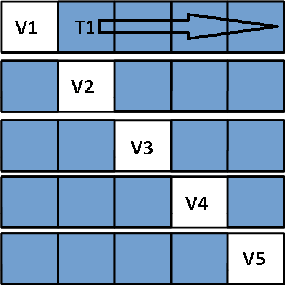

```{r setup, include=FALSE}
knitr::opts_chunk$set(echo = TRUE, warning = FALSE, message = FALSE)
```

## Introduction
In [Part 3](http://rpubs.com/mszczepaniak/predictkbo3model), we built the model used to make predictions, but we had arbitrarily chosen values for the two parameters in the model which were the discount rates at the bigram and trigram levels: $\gamma_2$ and $\gamma_3$.  In this installment, we'll determine good values for these discount rates using 5-fold cross-validation on the training partitions of the Blogs corpus.  After selecting the best looking values, we'll conclude the analysis with an accuracy estimate using the held out test set.

## K-Fold Cross-Validation
In their book [*An Introduction to Statistical Learning* [1]](http://www-bcf.usc.edu/~gareth/ISL/) James, Witten, Hastie, and Tibshirani describe K-Fold Cross-Validation as follows:

*This approach involves randomly dividing the set of observations into k groups, or **folds** of approximately equal size.  The first fold is treated as a validation set, and the method is fit on the remaining k - 1 folds.*  

A good way to start understanding this approach is to first visualize breaking the data into k roughly equal partitions.  In our case k=5, so we can use the picture below to illustrate the process.  



### Training The Model
Note: Unless mentioned otherwise, all code referred to in this document is listed in the **Appendix**.

#### Step 1 - Make and Partition the Folds

Each fold is represented as one of the five rows shown in the picture above.  Random indices for lines in the **blogs** corpus were selected using the **makeFolds** function to create each of the folds in the data.  Within each fold there are 3 partitions.  The **validation partition** was created using the **readFolds** function and is depicted by the white box in each fold (20% of the data in a fold).  The remaining non-validation data is subdivided into two groups: 1) the **training set** (80% of the non-validation data) depicted as the blue boxes and 2) the **test set** (20% of the non-validation data) depicted as the gold boxes.  These non-validation partitions were created from the indices generated using the **makeTrainTestNV** function.  The resulting data files for each of the fold partitions are listed in the table below.

Fold | Blogs Validation Set | Blogs Training Set | Blogs Test Set
-----|---------------:|--------------:|--------------:
1    | [fold_1blogs.txt](https://www.dropbox.com/s/fo7ybvw4h7de2e8/fold_1blogs.txt?dl=1) | [fold_1train_blogs.txt](https://www.dropbox.com/s/n4cne11vjodd6lg/fold_1train_blogs.txt?dl=1) | [fold_1test_blogs.txt](https://www.dropbox.com/s/ezlxnaxwfb7df4x/fold_1test_blogs.txt?dl=1) 
2    | [fold_2blogs.txt](https://www.dropbox.com/s/ufnm970okjwqi7j/fold_2blogs.txt?dl=1)   | [fold_2train_blogs.txt](https://www.dropbox.com/s/0dmqnxdk6liwne4/fold_2train_blogs.txt?dl=1) | [fold_2test_blogs.txt](https://www.dropbox.com/s/y6ixs9rqyc2ovpl/fold_2test_blogs.txt?dl=1) 
3    | [fold_3blogs.txt](https://www.dropbox.com/s/lzbg2zuixhcwzev/fold_3blogs.txt?dl=1) | [fold_3train_blogs.txt](https://www.dropbox.com/s/0aqfxf6al4wvgjm/fold_3train_blogs.txt?dl=1) | [fold_3test_blogs.txt](https://www.dropbox.com/s/u1x7vlv4n2xh147/fold_3test_blogs.txt?dl=1) 
4    | [fold_4blogs.txt](https://www.dropbox.com/s/cxt7bmjd5qebhkr/fold_4blogs.txt?dl=1) | [fold_4train_blogs.txt](https://www.dropbox.com/s/yszu99pc80xcmg8/fold_4train_blogs.txt?dl=1) | [fold_4test_blogs.txt](https://www.dropbox.com/s/8zndrfw113ork6a/fold_4test_blogs.txt?dl=1) 
5    | [fold_5blogs.txt](https://www.dropbox.com/s/cl3ifhr5hjercuy/fold_5blogs.txt?dl=1) | [fold_5train_blogs.txt](https://www.dropbox.com/s/g9sji96yg5j9n8d/fold_5train_blogs.txt?dl=1) | [fold_5test_blogs.txt](https://www.dropbox.com/s/b55ckj6n5engwcy/fold_5test_blogs.txt?dl=1) 

#### Step 2 - Create the N-Gram Frequency Tables for Each Folds Training Set

The training data (depicted in blue) is used to build the model which in addition to the algorithm described in [Part 3](http://rpubs.com/mszczepaniak/predictkbo3model), consists of three n-gram tables: a unigram table, a bigram table, and a trigram table which were created using the **makeFoldNgramTables** function and written to files using the **exportFoldNgramTables** function.  The results of running these two functions are the n-gram frequency tables used for each fold which are listed in the table below.

Fold | Unigram Table | Bigram Table | Trigram Table
-----|---------------:|--------------:|--------------:
1    | [fold_1train_blogs_1grams.csv](https://www.dropbox.com/s/89xmp86kcq4imbt/fold_1train_blogs_1grams.csv?dl=1) | [fold_1train_blogs_2grams.csv](https://www.dropbox.com/s/v138wq8qqodytlx/fold_1train_blogs_2grams.csv?dl=1) | [fold_1train_blogs_3grams.csv](https://www.dropbox.com/s/s1wy7wpcabwnid6/fold_1train_blogs_3grams.csv?dl=1) 
2    | [fold_2train_blogs_1grams.csv](https://www.dropbox.com/s/ulonwdefqlkvadi/fold_2train_blogs_1grams.csv?dl=1) | [fold_2train_blogs_2grams.csv](https://www.dropbox.com/s/8ne5w2pqijxvedu/fold_2train_blogs_2grams.csv?dl=1) | [fold_2train_blogs_3grams.csv](https://www.dropbox.com/s/981lj96d9uze1mu/fold_2train_blogs_3grams.csv?dl=1) 
3    | [fold_3train_blogs_1grams.csv](https://www.dropbox.com/s/gylc3tve3xkllse/fold_3train_blogs_1grams.csv?dl=1) | [fold_3train_blogs_2grams.csv](https://www.dropbox.com/s/aa5upx8lkhgrr4p/fold_3train_blogs_2grams.csv?dl=1) | [fold_3train_blogs_3grams.csv](https://www.dropbox.com/s/2opa05btgdbwny5/fold_3train_blogs_3grams.csv?dl=1) 
4    | [fold_4train_blogs_1grams.csv](https://www.dropbox.com/s/rrhn331argltkoq/fold_4train_blogs_1grams.csv?dl=1) | [fold_4train_blogs_2grams.csv](https://www.dropbox.com/s/9jju7m3dbj944jh/fold_4train_blogs_2grams.csv?dl=1) | [fold_4train_blogs_3grams.csv](https://www.dropbox.com/s/wkjqndg7hluulyi/fold_4train_blogs_3grams.csv?dl=1) 
5    | [fold_5train_blogs_1grams.csv](https://www.dropbox.com/s/3iv0licjiu1g1t4/fold_5train_blogs_1grams.csv?dl=1) | [fold_5train_blogs_2grams.csv](https://www.dropbox.com/s/znmtr4qsk49yysb/fold_5train_blogs_2grams.csv?dl=1) | [fold_5train_blogs_3grams.csv](https://www.dropbox.com/s/euo1dxrn8iu6b68/fold_5train_blogs_3grams.csv?dl=1) 

#### Step 3 - Select the $(\gamma_2, \gamma_3)$ Values to Run Against the Test Set

In addition to the n-gram tables, we also need to specify two parameters: a bigram discount rate, and a trigram discount rate.  These were the $\gamma_2$ and $\gamma_3$ variables described in [Part 3](http://rpubs.com/mszczepaniak/predictkbo3model).  We vary each discount rate from 0.1 to 1.9 in steps of 0.1.  This gives us a 19 x 19 = 361 combinations to train over.

#### Step 4 - Build Model Inputs and Run Model to Make Predictions

To assess the accuracy of the model, we need to give it a set of bigrams, have the model predict the words that follow each bigram input, and then deterimine how accurate the predictions were.  We do this by selecting 500 random trigrams from the test set (depicted in gold), parsing out the first two words to use as input to the prediction model and then using the last word to determine if the model predicted accurately or not.  The random trigrams for each fold were created and written to files using the **makePredictTrigrams** function and these trigrams are in files which are listed in the **Blogs Prediction Trigrams** column in the table shown below.

For each fold, a pair of discount rates $(\gamma_2, \gamma_3)$ is selected, 500 predictions are made, and the number of accurate predictions are tallied.  We then select another pair of the 361 combinations of $(\gamma_2, \gamma_3)$, make another 500 predictions, and assess the accuracy.  The function **trainFold** repeats this process for a single fold until all combinations of $(\gamma_2, \gamma_3)$ pairs have been run.  Running 500 predictions for each of the 361 combinations of $(\gamma_2, \gamma_3)$ in each of the 5 folds was a very time consuming process which is why only the results for the **Blogs** corpus are being reported here.  The results for each fold were written to files which are listed below.  The code that follows computes the values that populate the last 2 columns of the table that follows.

```{r cache=TRUE}
## Returns a list containing 3 vectors.  The 1st vector holds the values for
## the "Worst X Accuracy" column.  The 2nd vector holds the values for the
## "Worst X Accuracy" column where X = 'Train' or 'Validation'.  The 3rd
## vector holds the values for the "Best Count" column in the tables that follow.
getBestWorstResults <- function(fold_results_files=
                           c('https://www.dropbox.com/s/524dgfw0ej2d4m3/cv_blogs_fold1_itrs500.csv?dl=1',
                             'https://www.dropbox.com/s/2k5ypy3sovn6g9d/cv_blogs_fold2_itrs500.csv?dl=1',
                             'https://www.dropbox.com/s/85ex5o9km20014m/cv_blogs_fold3_itrs500.csv?dl=1',
                             'https://www.dropbox.com/s/5rf7mbhrpq617e9/cv_blogs_fold4_itrs500.csv?dl=1',
                             'https://www.dropbox.com/s/vxq9bl6bmagv1x2/cv_blogs_fold5_itrs500.csv?dl=1')) {
    library(dplyr)
    filler <- rep(-1, length(fold_results_files))
    train_results <- list(worst_acc=filler, best_acc=filler, best_count=filler)
    for(i in 1:length(fold_results_files)) {
        fold_results <- read.csv(fold_results_files[i])
        fold_results <- arrange(fold_results, desc(acc))
        train_results[['worst_acc']][i] <- c(fold_results$acc[nrow(fold_results)])
        train_results[['best_acc']][i] <- c(fold_results$acc[1])
        train_results[['best_count']][i] <-
            c(nrow(filter(fold_results, acc==train_results[['best_acc']][i])))
    }
    
    return(train_results)
}

fold_train <- getBestWorstResults()
fold_train_worst <- fold_train[['worst_acc']]
fold_train_best <- fold_train[['best_acc']]
fold_train_best_count <- fold_train[['best_count']]
```


Fold | Blogs Prediction Trigrams | Blogs Results Files | Worst Train Accuracy | Best Train Accuracy | Best $(\gamma_2, \gamma_3)$ count 
-----|-----------:|---------------:|--------:|--------:|--------:
1    | [fold_1blogs_predict.txt](https://www.dropbox.com/s/ow47mbpakiuhk0l/fold_1blogs_predict.txt?dl=1) | [cv_blogs_fold1_itrs500.csv](https://www.dropbox.com/s/524dgfw0ej2d4m3/cv_blogs_fold1_itrs500.csv?dl=1) | `r fold_train_worst[1]` | `r fold_train_best[1]` | `r fold_train_best_count[1]`
2    | [fold_2blogs_predict.txt](https://www.dropbox.com/s/11lwb0356cyzh72/fold_2blogs_predict.txt?dl=1) | [cv_blogs_fold2_itrs500.csv](https://www.dropbox.com/s/2k5ypy3sovn6g9d/cv_blogs_fold2_itrs500.csv?dl=1) | `r fold_train_worst[2]` | `r fold_train_best[2]` | `r fold_train_best_count[2]`
3    | [fold_3blogs_predict.txt](https://www.dropbox.com/s/v8wutg9s8n9s43r/fold_3blogs_predict.txt?dl=1) | [cv_blogs_fold3_itrs500.csv](https://www.dropbox.com/s/85ex5o9km20014m/cv_blogs_fold3_itrs500.csv?dl=1) | `r fold_train_worst[3]` | `r fold_train_best[3]` | `r fold_train_best_count[3]`
4    | [fold_4blogs_predict.txt](https://www.dropbox.com/s/8c4scmda1z2ny4k/fold_4blogs_predict.txt?dl=1) | [cv_blogs_fold4_itrs500.csv](https://www.dropbox.com/s/5rf7mbhrpq617e9/cv_blogs_fold4_itrs500.csv?dl=1) | `r fold_train_worst[4]` | `r fold_train_best[4]` | `r fold_train_best_count[4]`
5    | [fold_5blogs_predict.txt](https://www.dropbox.com/s/2frdvo0d2vupnk3/fold_5blogs_predict.txt?dl=1) | [cv_blogs_fold5_itrs500.csv](https://www.dropbox.com/s/vxq9bl6bmagv1x2/cv_blogs_fold5_itrs500.csv?dl=1) | `r fold_train_worst[5]` | `r fold_train_best[5]` | `r fold_train_best_count[5]`

#### Step 5 - Run the Best $(\gamma_2, \gamma_3)$ Values Against the Validation Set

This step first requires generating the prediction trigrams from the validation partition as described in the previous step except using the *validation set** of each fold instead of the non-validation training set.

From the table in **Step 4**, we see that a number of $(\gamma_2, \gamma_3)$ combinations resulted in the highest accuracy on the non-validation test set.  Each of these pairs were obtained by running the **getBestDiscountPairs** function and then written to the files listed in the **Best Blog Training** column of the table below.  These best training pairs were then run against the validation set by running the **getValidationResults** function and the highest accuracy was found to be the values reported in the **Best Validation Accuracy** column.  The values for the last 2 columns of the table below were computed using the same **getBestResults** function used in the previous table.

```{r cache=TRUE}
validation_results_files <- 
    c('https://www.dropbox.com/s/t8kv3eultbrg5b4/cv_blogs_fold1_itrs500.csv?dl=1',
      'https://www.dropbox.com/s/va3uq4f1h6fb1n8/cv_blogs_fold2_itrs500.csv?dl=1',
      'https://www.dropbox.com/s/rxuviidj7gb16k1/cv_blogs_fold3_itrs500.csv?dl=1',
      'https://www.dropbox.com/s/dzser8x5dcgevkn/cv_blogs_fold4_itrs500.csv?dl=1',
      'https://www.dropbox.com/s/n4d4mj0rcryfvin/cv_blogs_fold5_itrs500.csv?dl=1')

fold_train <- getBestWorstResults(validation_results_files)
fold_valid_worst <- fold_train[['worst_acc']]
fold_valid_best <- fold_train[['best_acc']]
fold_valid_best_count <- fold_train[['best_count']]
```

Fold | Blogs Validation Prediction Trigrams | Best Blogs Training | Worst Validation Accuracy | Best Validation Accuracy | Best $(\gamma_2, \gamma_3)$ count
-----|-----------:|-----------:|-----------:|-----------:|-----------:
1    | [fold_1valid_predict.txt](https://www.dropbox.com/s/9hml06iwp4w9up5/fold_1valid_predict.txt?dl=1) | [fold1_best_train.csv](https://www.dropbox.com/s/u15w787s9v6qcj8/fold1_best_train.csv?dl=1) | `r fold_valid_worst[1]` | `r fold_valid_best[1]` | `r fold_valid_best_count[1]`
2    | [fold_2valid_predict.txt](https://www.dropbox.com/s/kp0tqlpmphl7ooc/fold_2valid_predict.txt?dl=1) | [fold2_best_train.csv](https://www.dropbox.com/s/gos25qrdjhvqght/fold2_best_train.csv?dl=1) |`r fold_valid_worst[2]` | `r fold_valid_best[2]` | `r fold_valid_best_count[2]`
3    | [fold_3valid_predict.txt](https://www.dropbox.com/s/ixjh28hfy3yjs53/fold_3valid_predict.txt?dl=1) | [fold3_best_train.csv](https://www.dropbox.com/s/fb7wpjmjnadh2h6/fold3_best_train.csv?dl=1) |`r fold_valid_worst[3]` | `r fold_valid_best[3]` | `r fold_valid_best_count[3]`
4    | [fold_4valid_predict.txt](https://www.dropbox.com/s/upjgml1wf3im2x3/fold_4valid_predict.txt?dl=1) | [fold4_best_train.csv](https://www.dropbox.com/s/492kt8jfnf03v85/fold4_best_train.csv?dl=1) |`r fold_valid_worst[4]` | `r fold_valid_best[4]` | `r fold_valid_best_count[4]`
5    | [fold_5valid_predict.txt](https://www.dropbox.com/s/ducfh5ju5v80yyd/fold_5valid_predict.txt?dl=1) | [fold5_best_train.csv](https://www.dropbox.com/s/ul23lcb8ln80gdd/fold5_best_train.csv?dl=1) |`r fold_valid_worst[5]` | `r fold_valid_best[5]` | `r fold_valid_best_count[5]`

### Selecting the Best Discount Pair

The highest accuracy was found in fold 5, but 28 different $(\gamma_2, \gamma_3)$ pairs all yielded the same best accuracy of `r fold_valid_best[5]`.  The problem now shifts to deciding which of these 28 pairs should be selected.  The table in **Step 5** provides at least three useful clues.

The first clue is that within each fold, a number of $(\gamma_2, \gamma_3)$ combinations result in the highest accuracy for that fold.  The second clue is that the difference between the worst and best accuracy within a valildation fold is either small or non-existant.  The third clue is that the best training accuracy values are all rather similar.  Taken together, this suggests that a reasonable way to break the tie between the 28 pairs is to select the pair that has the greatest overlap with the other folds.  For example, if one of the 28 pairs turns out to produce the best accuracy in the other 4 folds as well, that pair would be the winner.

The first step is to find the overlap in the $(\gamma_2, \gamma_3)$ spaces over the folds.  Since each fold tests a different set of $(\gamma_2, \gamma_3)$ pairs against the validation set, we expand each of the validation results into the original 2D grid so that we can aggragate them easily.  This was done by running the **expandAllValidationResults** function.  We then convert these to matices using the **convertDfToContourMatrix** function, add them up, and then pass the resulting matrix to **contour** to get a quick visual of the results.

```{r cache=TRUE, fig.width=7, fig.height=7}
## The 5 files in this vector were created by running the expandAllValidationResults
## function using the files from the table in Step 5 in the "Best Blogs Train" column
vresults <- c('https://www.dropbox.com/s/9n44g9d36yysn06/fold1valid_exp.csv?dl=1',
              'https://www.dropbox.com/s/dnw7zzizoc27mfa/fold2valid_exp.csv?dl=1',
              'https://www.dropbox.com/s/qhfnoygwueodz0u/fold3valid_exp.csv?dl=1',
              'https://www.dropbox.com/s/deu5zqrra4livt8/fold4valid_exp.csv?dl=1',
              'https://www.dropbox.com/s/lkgqo1xurtvllp2/fold5valid_exp.csv?dl=1')
f1 <- read.csv(vresults[1])
f2 <- read.csv(vresults[2])
f3 <- read.csv(vresults[3])
f4 <- read.csv(vresults[4])
f5 <- read.csv(vresults[5])

## Converts a dataframe of xyz values to a matrix which can be consumed by
## the r base graphic function contour
convertDfToContourMatrix <- function(df, xname, yname, zname) {
    # http://stackoverflow.com/questions/7531868
    names(df)[names(df) == xname] <- 'x'
    names(df)[names(df) == yname] <- 'y'
    names(df)[names(df) == zname] <- 'z'
    x_values <- sort(unique(df$x))
    y_values <- sort(unique(df$y))
    cont_mat <- matrix(-1, nrow = length(x_values), ncol = length(y_values))
    rownames(cont_mat) <- x_values
    colnames(cont_mat) <- y_values
    index <- 1
    for(ix in 1:length(x_values)) {
        for(jy in 1:length(y_values)) {
            cont_mat[ix, jy] <- df$z[index]
            index <- index + 1
        }
    }
    
    return(cont_mat)
}

cm1 <- convertDfToContourMatrix(f1, 'gamma2', 'gamma3', 'acc')
cm2 <- convertDfToContourMatrix(f2, 'gamma2', 'gamma3', 'acc')
cm3 <- convertDfToContourMatrix(f3, 'gamma2', 'gamma3', 'acc')
cm4 <- convertDfToContourMatrix(f4, 'gamma2', 'gamma3', 'acc')
cm5 <- convertDfToContourMatrix(f5, 'gamma2', 'gamma3', 'acc')

comp_mat <- cm1+cm2+cm3+cm4+cm5
xgrid <- sort(unique(f1$gamma2))  # could use any of the 5 fold results
ygrid <- sort(unique(f1$gamma3))
contour(x=xgrid, y=ygrid, comp_mat, xlab='gamma2', ylab='gamma3',
        main="Validation Accuracy vs. Bigram & Trigram Discounts")
```

Some (like me) find it easier to view this kind of data as a heatmap.  In the plot below, red is largest and white is zero.  Note also that zero in both the plot above and below are just regions that were not selected in the final validation runs.

```{r fig.width=7, fig.height=5.5}
# Shouldn't have to repeat this vector, but knitter was crashing...
vresults <- c('https://www.dropbox.com/s/9n44g9d36yysn06/fold1valid_exp.csv?dl=1',
              'https://www.dropbox.com/s/dnw7zzizoc27mfa/fold2valid_exp.csv?dl=1',
              'https://www.dropbox.com/s/qhfnoygwueodz0u/fold3valid_exp.csv?dl=1',
              'https://www.dropbox.com/s/deu5zqrra4livt8/fold4valid_exp.csv?dl=1',
              'https://www.dropbox.com/s/lkgqo1xurtvllp2/fold5valid_exp.csv?dl=1')
## Returns a dataframe that has summed all the accuracy values (acc column) in
## each of the files in the results_files vector.
aggregateFolds <- function(out_dir="D:/Dropbox/sw_dev/projects/PredictNextKBO/cv/validation/",
                           results_files=vresults) {
    
    g2_vector <- read.csv(results_files[1])$gamma2
    g3_vector <- read.csv(results_files[1])$gamma3
    acc_totals <- vector(mode = "numeric", length = length(g3_vector))
    for(file in results_files) {
        acc_totals <- acc_totals + read.csv(file)$acc  # just add acc vector
    }
    
    return(data.frame(gamma2=g2_vector, gamma3=g3_vector, acc=acc_totals))
}

agg_folds <- aggregateFolds()

# install.packages('latex2exp')
library(latex2exp)
library(ggplot2)
# Nice nugget to get Latex into the x and y axis labels:
# http://stackoverflow.com/questions/1395105/getting-latex-into-r-plots#30787000
g2 <- TeX('Bigram Discount  $\\gamma_2$')
g3 <- TeX('Trigram Discount  $\\gamma_3$')

p <- ggplot(agg_folds, aes(gamma2, gamma3, fill = acc)) + geom_tile()
p <- p + xlab(g2) + ylab(g3)
p <- p + ggtitle("Validation Accuracy vs. Bigram & Trigram Discounts")
p <- p + scale_fill_gradient(limits = c(0, 0.6), low = "white", high = "red")
# p <- p + scale_fill_brewer(palette = "PRGn")
p <- p + scale_x_continuous(expand = c(0,0))
p <- p + scale_y_continuous(expand = c(0,0))
p <- p + theme(panel.border = element_rect(colour = "black", fill=NA, size=1))
p
```

It appears that the discount "sweet spot" is in the lower right portion of the contour and heat maps.  Accuracy appeared to improve as trigram discount was decreased.  The region of highest overlap was the region where $0 < \gamma_2 = 0.2$ and $1.4 \geq \gamma_3 \leq 1.8$.  Three of the folds needed to overlap in order to form this region.  The center of the sweet spot is approximately $(\gamma_2 = 1.6, \gamma_3 = 0.1)$ and is what we are selecting as our best values based on this analysis.

### Running Best Values Against Test Set

Now that we have selected our best values, it time to run them against the test data which the model has not seen.  As we did during training and validation, we'll select 500 random trigrams from the held out test set, make predictions on each of these trigram and do this 100 times so that we can get estimates for the test set accuracy and the confidence interval of this estimate.

#### How Final Model was Constructed

As mentioned earlier, the model is composed of three parts: an algorithm implementation (Katz Back-Off Trigram), three n-gram frequency tables (unigram, bigram, and trigram), and values for the two discount parameters (bigram and trigram).  The algorithm is implemented in the **getTopPrediction ** function.  The n-gram frequency tables for the training set of fold 5 will be used. Finally, we use values of $(\gamma_2 = 1.6, \gamma_3 = 0.1)$ for the bigram and trigram discounts respectively.

#### Results on the Test Set

The results can be found in the file:  [en_US.blogs.test.acc_estimate.csv](https://www.dropbox.com/s/rtig68inboe5qyr/en_US.blogs.test.acc_estimate.csv?dl=1)  
A histogram of these results is shown below:

```{r}
library(ggplot2)
dat <- read.csv('https://www.dropbox.com/s/rtig68inboe5qyr/en_US.blogs.test.acc_estimate.csv?dl=1', FALSE)
p <- ggplot(data=dat, aes(dat$V1))
p <- p + geom_histogram(breaks=seq(0.134, 0.234, length.out = 9),
                        col="red", 
                        fill="green", 
                        alpha = .2) +
                        labs(title="Precition Accuracy on Test Set") +
                        labs(x="Prediction Accuracy", y="Count") + 
                        xlim(c(0.134, 0.234)) + 
                        ylim(c(0,25))
p

```


### Confidence Interval

The standard error of our accuracy estimates are proportions, so we use the following equation for this calculation [[5]](http://stattrek.com/estimation/confidence-interval-proportion.aspx):

$$SE_p = \sqrt{\frac{\pi(1-\pi)}{n}}$$

if $n\pi \geq 10$ and $n(1 - \pi) \geq 10$

Since taking 500 samples, making predictions and doing this 100 times is the same as taking n = 5000 samples and making predictions, we can compute $\pi$ by averaging our 100 values for accuracy resulting in 

```{r}
total_sample_count = 500 * 100
pi_val = mean(dat$V1)
n_pi = total_sample_count * pi_val
n_one_minus_pi = total_sample_count * (1 - pi_val)
c(pi_val, n_pi, n_one_minus_pi)
```
which indicates we are fine using the normal approximation for the standard error stated above.

```{r}
std_err_p = sqrt(pi_val * (1 - pi_val) / total_sample_count)
std_err_p

```
If we assume a 95% confidence interval, we get the following lower and upper bound on our accuracy:

```{r}
pi_low = pi_val - (1.96 * std_err_p)
pi_high = pi_val + (1.96 * std_err_p)
c(pi_low, pi_high)

```


### Conclusion

The best this version of the KBO model could do on the blogs corpus was about 18% accuracy.  We expect the accuracy to vary between `r format(round(pi_low, 4), nsmall=4)` and `r format(round(pi_high, 4), nsmall=4)` with 95% confidence.  It would be interesting to compare the results of this analysis process with the news and twitter corpora.  Before attempting to analyze the other corpora in this fashion however, some work to speed up the computations would need to be done because it took a couple of weeks for my systems to crunch through all the prediction calculations.

In [**Part 2**](http://rpubs.com/mszczepaniak/predictkbo2ngeda) of this series, the case was made for removing unigram singletons in order to improve accuracy and performance.  The same line of reasoning would suggest that removing items with counts of less than 2, 3, 4, or 5 from the n-gram tables should be investigated as well.

After doing the initial work on this project, I learned [**here**[6]](https://www.coursera.org/learn/neural-networks/lecture/68Koq/another-diversion-the-softmax-output-function-7-min) that accuracy is not the best way to access the performance of a language model like this.  A better measure to use for optimizing the discount rates would be something like the [cross entropy](https://en.wikipedia.org/wiki/Cross_entropy#Cross-entropy_error_function_and_logistic_regression).

I'm kicking around doing a concurrent neural net model to achieve the same task.  The cross entropy will be the right method to optimize the weight matrices in this context.

### References
[1] An Introduction to Statistical Learning -  
[http://www-bcf.usc.edu/~gareth/ISL/](http://www-bcf.usc.edu/~gareth/ISL/)  
[2] Trevor Hastie & Rob Tibshirani on Cross-Validation (part 1) -  
[https://www.youtube.com/watch?v=_2ij6eaaSl0](https://www.youtube.com/watch?v=_2ij6eaaSl0)  
[3] Trevor Hastie & Rob Tibshirani on K-Fold Cross-Validation (part 2) -  
[https://www.youtube.com/watch?v=nZAM5OXrktY](https://www.youtube.com/watch?v=nZAM5OXrktY)  
[4] Trevor Hastie & Rob Tibshirani on Right & Wrong Ways to do CV (part 3) -  
[https://www.youtube.com/watch?v=S06JpVoNaA0](https://www.youtube.com/watch?v=S06JpVoNaA0)  
[5] Rule of Sample Proportions (Normal Approximation Method) - [https://onlinecourses.science.psu.edu/stat200/node/43](https://onlinecourses.science.psu.edu/stat200/node/43)  
[6] Neural Networks for Machine Learning - Week 4 *(starting around 4:14)* - [https://www.coursera.org/learn/neural-networks/lecture/68Koq/another-diversion-the-softmax-output-function-7-min](https://www.coursera.org/learn/neural-networks/lecture/68Koq/another-diversion-the-softmax-output-function-7-min)

### Appendix

```{r eval=FALSE}
## Returns a list with nfolds items. Each list contains the indices for the 
## data in each fold. Indices are then written to files: one set of indices
## per fold.
## 
## indices_count - int that are the number of items to take a sample from. If
##                 sample data is a data frame, this is typically nrows(data).
## nfolds - number of folds in the data to make
## write_folds - boolean, TRUE if indices for each fold should be written to files
## fold_indices_file_prefix - start of the output file name
## fold_indices_file_postfix - end of the output file name
## out_dir - directory to write the output files if write_folds == TRUE
## seed_value - seed value for random selects, set for reproducibility
makeFolds <- function(indices_count, nfolds=5, write_folds=TRUE,
                      fold_indices_file_prefix="fold_",
                      fold_indices_file_postfix="blogs",
                      fold_indices_file_ext=".txt",
                      out_dir="./", seed_value=719) {
    set.seed(seed_value)
    folds <- vector("list", nfolds)
    inds <- 1:indices_count
    min_per_fold <- length(inds) / nfolds # min # of samples in each fold
    for(i in 1:nfolds) {
        samp_inds = sample(inds, min_per_fold) # get indices for fold
        folds[[i]] <- samp_inds
        inds <- setdiff(inds, samp_inds) # remaining after taking for fold
        if(i == nfolds) {
            cat("there are ", length(inds), "remaining samples to distribute.\n")
            for(j in 1:length(inds)) {
                samp <- sample(inds, 1)
                folds[[j]] <- c(folds[[j]], samp)
                inds <- setdiff(inds, samp)
            }
        }
    }
    # write out the indices in each fold
    if(write_folds) {
        for(k in 1:nfolds) {
            out_file <- sprintf("%s%s%s%s", fold_indices_file_prefix, k,
                                fold_indices_file_postfix,
                                fold_indices_file_ext)
            out_file <- sprintf("%s%s", out_dir, out_file)
            write.table(folds[[k]], out_file, quote=FALSE, sep="\n",
                        row.names=FALSE, col.names=FALSE)
            cat("Finished writing", out_file, "\n")
        }
    }
    
    return(folds)
}
```
```{r eval=FALSE}
if(!exists('fold_paths')) {
    # Note: These files need to be generated from the makeFolds function
    blogs_paths <- c("https://www.dropbox.com/s/fo7ybvw4h7de2e8/fold_1blogs.txt?dl=1",
                     "https://www.dropbox.com/s/ufnm970okjwqi7j/fold_2blogs.txt?dl=1",
                     "https://www.dropbox.com/s/lzbg2zuixhcwzev/fold_3blogs.txt?dl=1",
                     "https://www.dropbox.com/s/cxt7bmjd5qebhkr/fold_4blogs.txt?dl=1",
                     "https://www.dropbox.com/s/cl3ifhr5hjercuy/fold_5blogs.txt?dl=1")
    news_paths <- c("https://www.dropbox.com/tdb",
                    "https://www.dropbox.com/tdb",
                    "https://www.dropbox.com/tdb",
                    "https://www.dropbox.com/tdb",
                    "https://www.dropbox.com/tdb")
    twitr_paths <- c("https://www.dropbox.com/tdb",
                     "https://www.dropbox.com/tdb",
                     "https://www.dropbox.com/tdb",
                     "https://www.dropbox.com/tdb",
                     "https://www.dropbox.com/tdb")
    fold_paths <- data.frame(blogs=blogs_paths, news=news_paths,
                             twitter=twitr_paths, stringsAsFactors = FALSE)
}

## Returns a list of length(fold_paths) + 1 items.  Each item in the list is a
## vector of ints that are indices assigned to a validation fold except for
## the last item which is the total line count of all the folds
## fold_paths - a 5 x 3 data frame where each column is a corpus type:
##              "blogs", "news", or "twitter" and each row is a fold.
##              Each element is a url to a file which defines the indices
##              of the validation set for the corpus type and fold
## corp_type - character string, type of corpus: "blogs", "news", "twitter"
readFolds <- function(fold_paths, corp_type='blogs') {
    fold_count <- nrow(fold_paths)
    folds <- vector("list", fold_count+1)
    line_count <- 0
    for(i in 1:fold_count) {
        path <- fold_paths[i, corp_type]
        fold <- read.csv(path, header=FALSE)
        line_count <- line_count + nrow(fold)
        folds[[i]] <- fold$V1
    }
    
    folds[[fold_count + 1]] <- line_count
    
    return(folds)
}

if(!exists('default_folds')) {
    cat("reading fold data...\n")
    default_folds <- readFolds(fold_paths)
}

if(!exists('corpus_urls')) {
    rm(list = ls())
    corpus_urls <- c("https://www.dropbox.com/s/9dx3oo1w5uf8n1t/en_US.blogs.train.8posteos.txt?dl=1",
                     "https://www.dropbox.com/s/54cvi36161y6pvk/en_US.news.train.8posteos.txt?dl=1",
                     "https://www.dropbox.com/s/6ayhavfnzs5lmqa/en_US.twitter.train.8posteos.txt?dl=1")
    names(corpus_urls) <- c("blogs", "news", "twitter")
}

## Returns a named list of int vectors which are indices of training and  
## testing sets in the Non-Validation partition.  The odd numbered lists 
## contain the indices of the lines used for the training set.  Each set of 
## training fold indices are named in the following manner:
## fold_xtrain_y where x is an integer 1 to number of folds and
##                     y is one of the corpus types: blogs, news, twitter
## The even numbered lists contain the indices of the lines used for testing
## set.  Each set of testing fold indices are named in the following manner:
## fold_xtest_y where x is an integer 1 to number of folds and
##                    y is one of the corpus types: blogs, news, twitter
## The function writes out both training and test set indices to text files
## using the naming convention described above with a .txt extension.
## 
## PARAMETERS:
## folds - list of int vectors of size length(folds) which are indices of the
##         lines for each validation partition. Indices not in this set are 
##         further segmented into training and testing sets
## corp_type - character string, type of corpus: "blogs", "news", "twitter"
## train_fraction - float betwee 0 and 1 (non-inclusive), fraction of samples
##                  used for the test set, 
## seed_vals - seed values to use for train/test set selections
## ofile_prefix - string, output file name prefix
## ofile_postfix - string, output file name postfix
## out_dir - string, directory to write output files
makeTrainTestNV <- function(folds=default_folds, corp_type="blogs",
                            train_fraction=0.8,
                            seed_vals=c(7,11,13,17,19),
                            ofile_prefix="fold_",
                            ofile_postfix=c("train.txt", "test.txt"),
                     out_dir="D:/Dropbox/sw_dev/projects/PredictNextKBO/cv/") {
    corpus_lines <- read_lines(corpus_urls[corp_type])
    fold_count <- length(folds) - 1  # because last count is total line count
    results <- list() #vector("list", 2*fold_count)
    ofile_paths <- vector(mode = "character")
    for(i in 1:fold_count) {
        seed_val <- seed_vals[i]
        set.seed(seed_val)  # set for reproducibility
        validn_fold_indices <- folds[[i]]
        non_validn_fold_indices <- setdiff(1:folds[[fold_count+1]],
                                           validn_fold_indices)
        validn_data <- corpus_lines[validn_fold_indices]
        # Take 80% (train set) of non-validation data to build n-gram tables 
        # and use the other 20% (test set) to make predicitions on.
        train_ngrams_indices <-
            sample(non_validn_fold_indices,
                   train_fraction * length(non_validn_fold_indices))
        test_gammas_indices <- setdiff(non_validn_fold_indices,
                                       train_ngrams_indices)
        
        name_prefix <- sprintf("%s%s%s%s","fold_", i, "train_", corp_type)
        fname <- sprintf("%s%s%s", out_dir, name_prefix, ".txt")
        results[[name_prefix]] <- train_ngrams_indices
        write.table(train_ngrams_indices, fname, row.names=FALSE, col.names=FALSE)
        ofile_paths <- append(ofile_paths, fname)
        
        name_prefix <- sprintf("%s%s%s%s","fold_", i, "test_", corp_type)
        fname <- sprintf("%s%s%s", out_dir, name_prefix, ".txt")
        results[[name_prefix]] <- test_gammas_indices
        write.table(test_gammas_indices, fname, row.names=FALSE, col.names=FALSE)
        ofile_paths <- append(ofile_paths, fname)
    }
    
    return(results)
}

## Creates the 1 thru ng (n-gram) frequency tables for the training portion of each non-validation
## partition for each fold in the cv. Results are written to files named using the following
## format: fold_<fold number><corpus_type><ngram>grams.csv where:
##         fold number - valid values: 1:5, corpus_type  - valid values: "blogs", "news", "twitter"
##         ngram - valid values: 1:3
##         e.g. fold_1train_blogs_1grams.csv
##
## Precondition - Files containing the indices for the training and test lines for
##                for the non-validation partition of each fold have been created
##                (using the makeTrainTestNV function)
##
## corp_data - 2 col dataframe: 1st column, ctype are the corpora types
##                                          (blogs, news, twitter)
##                              2nd column, corp_urls are the urls to the
##                                          data of each corpora type
## ng - int vector specifying the n-grams to be created
## folds - list of int lists which are the output of the readFolds function
## cv_dir - directory to find cv fold indices data and where n-gram tables
##          are written to
## ofile_prefix - prefix of output file names
## ofile_postfix - postfix of output file names
makeFoldNgramTables <- function(corp_data=
                                data.frame(ctype=c("blogs", "news", "twitter"),
                                           corp_url=corpus_urls),
                                ng=1:3, folds=default_folds,
              cv_dir="D:/Dropbox/sw_dev/projects/PredictNextKBO/cv/",
              ofile_prefix="fold_", ofile_postfix="grams.csv") {
    for(c in 1:nrow(corp_data)) {
        corpus_type <- corp_data$ctype[c]
        corp_url <- corp_data$corp_url[c]
        corp_lines <- read_lines(corp_url)
        for(fold in 1:(length(folds)-1)) {
            train_fold_path <- sprintf("%s%s%s%s%s%s", cv_dir, "fold_", fold,
                                       "train_", corpus_type, ".txt")
            train_fold_indices <- read.table(train_fold_path, sep = "\n")$V1
            train_fold <- corp_lines[train_fold_indices]
            for(g in ng) {
                fname <- sprintf("%s%s%s%s%s%s%s", ofile_prefix, fold,
                                 "train_", corpus_type, "_", g, ofile_postfix)
                fpath <- sprintf("%s%s", cv_dir, fname)
                cat("Start table", fname, "building @ time:",
                    as.character(Sys.time()), "\n")
                # geNgramTables defined in http://rpubs.com/mszczepaniak/predictkbo3model
                ngram_table <- getNgramTables(g, train_fold)
                ngram_table <- filter(ngram_table, freq > 1) # remove singletons
                write.csv(ngram_table, fpath, row.names = FALSE)
                cat("Finish table", fpath, "write @ time:",
                    as.character(Sys.time()), "\n")
            }
        }
    }
}
```
```{r eval=FALSE}
## Exports ngram frequency tables for a series of CV folds as an RData object.
##
## Precondition: n-gram tables are assumed to have file names of the form:
##               fold_<fold><table_type><ngram>grams.csv
##
## ngram_table_dir - path to the dir containing n-gram tables for each fold.
##                   This dir is also were output is written.
## in_file_prefix - char vector representing the first part of the name for
##                  n-gram tables used for each cv fold, default="fold_"
## folds - vector of ints representing the folds in the cv, default=1:5
## table_type - char vector representing the type of corpus in which n-grams
##              are being constructed, valid values: "train_blogs_",
##              "train_news_", and "train_twitter_"
## ngrams - vector of ints representing the n-gram tables to be exported,
##          default 1:3 (unigram, bigram, trigram)
## in_file_suffix - suffix of the n-gram table to import
exportFoldNgramTables <- 
    function(ngram_table_dir="D:/Dropbox/sw_dev/projects/PredictNextKBO/cv/",
             in_file_prefix="fold_", folds=1:5, table_type="train_blogs_",
             ngrams=1:3, in_file_suffix="grams.csv") {
        fold_ngrams <- vector("list", length(folds))
        for(i in folds) {
            inner_ngrams <- vector("list", length(ngrams))
            for(j in ngrams) {
                ng_table_path <- paste0(ngram_table_dir, in_file_prefix, i,
                                        table_type, j, in_file_suffix)
                ng_table <- read.csv(ng_table_path)
                inner_ngrams[[j]] <- ng_table
            }
            fold_ngrams[[i]] <- inner_ngrams
        }
        ofile_path <- paste0(ngram_table_dir, file="foldNgramTables.RData")
        save(fold_ngrams, file=ofile_path)
    }

## Loads and returns a list of lists with 5 outer list elements corresponding
## to a CV fold number and 3 inner list elements which contain the unigram (1),
## bigram (index 2) and trigram (index 3) tables for a particular fold.
importFoldNgramtables <- 
    function(ngram_table_dir="D:/Dropbox/sw_dev/projects/PredictNextKBO/cv/") {
    
        ofile_path <- paste0(ngram_table_dir, file="foldNgramTables.RData")
        load(ofile_path)
        
        return(fold_ngrams)
}
```
```{r eval=FALSE}
## Creates and write out lists of random trigrams which can be used to
## determine prediction accuracy.  PARAMETERS:
## corp_type - string, corpus data to process: "blogs", "news", "twitter"
## npredict - # of predictions to make per parameter set (gamma2, gamma3)
## corp_urls - char vector, urls of where the corpora data files lives
## test_lines_dir - string, local dir where test partion indices live
## test_lines_files - char vector, paths to test partion indices files 
## ofile_prefix - string, output file prefix
## ofile_postfix - string, output file postfix
makePredictTrigrams <- function(corp_type="blogs", npredict=500,
                                corp_urls=corpus_urls,
              test_lines_dir="D:/Dropbox/sw_dev/projects/PredictNextKBO/cv/",
              test_lines_files=c("fold_1test_blogs.txt", "fold_2test_blogs.txt",
                                 "fold_3test_blogs.txt", "fold_4test_blogs.txt",
                                 "fold_5test_blogs.txt"),
                    ofile_prefix="fold_", ofile_postfix="blogs_predict.txt",
              out_dir="D:/Dropbox/sw_dev/projects/PredictNextKBO/cv/") {
    fold_count <- length(test_lines_files)
    for(i in 1:fold_count) {
        cat("reading test partition indices...\n")
        fold_indices_name <- paste0(test_lines_dir, test_lines_files[i])
        test_indices <- read.table(fold_indices_name, sep = "\n")$V1
        cat("reading corpus lines...\n")
        corpus_lines <- read_lines(corp_urls[corp_type])
        corpus_lines <- corpus_lines[test_indices]
        cat("selecting unique random trigrams...\n")
        predict_trigrams <- getUniqueRandomNgrams(corpus_lines, npredict)
        ofile_name <- paste0(out_dir, ofile_prefix, i, ofile_postfix)
        cat("writing unique random trigrams to", ofile_name, "...\n")
        writeLines(predict_trigrams, ofile_name)
    }
}

```

```{r eval=FALSE}
## Returns a single word character vector which has the highest probability of
## completing the trigram starting with the two words defined in the bigram
## prefix parameter bigPre based on the KBO Trigram alogrithm.
##
## bigPre - last 2 words of user input separated by an _ e.g. sell_the
##          This is also referred to as the bigram prefix in code futher
##          downstream.
## gamma2 - bigram discount rate
## gamma3 - trigram discount rate
## unigrams - 2 column data.frame: ngram - a unigram in the corpus of interest
##                                 freq - count of this unigram in the corpus
## bigrams - 2 column data.frame: ngram - a bigram in the corpus of interest
##                                freq - count of this bigram in the corpus
## trigrams - 2 column data.frame: ngram - a trigram in the corpus of interest
##                                 freq - count of this trigram in the corpus
getTopPrediction <- function(bigPre, gamma2, gamma3,
                             unigrams, bigrams, trigrams) {
    obs_trigs <- getObsTrigs(bigPre, trigrams)
    unobs_trig_tails <- getUnobsTrigTails(obs_trigs$ngram, unigrams)
    bo_bigrams <- getBoBigrams(bigPre, unobs_trig_tails)
    # separate bigrams which use eqn 10 and those that use 16
    obs_bo_bigrams <- getObsBoBigrams(bigPre, unobs_trig_tails, bigrams)
    unobs_bo_bigrams <- getUnobsBoBigrams(bigPre, unobs_trig_tails,
                                          obs_bo_bigrams)
    # calc obs'd bigram prob's from eqn 10
    qbo_obs_bigrams <- getObsBigProbs(obs_bo_bigrams, unigrams, gamma2)
    # calc alpha_big & unobs'd bigram prob's from eqn 16
    unig <- str_split(bigPre, "_")[[1]][2]
    unig <- unigrams[unigrams$ngram == unig,]
    alpha_big <- getAlphaBigram(unig, bigrams, gamma2)
    qbo_unobs_bigrams <- getQboUnobsBigrams(unobs_bo_bigrams, unigrams, alpha_big)
    # calc trigram probabilities - start with observed trigrams: eqn 12
    qbo_obs_trigrams <- getObsTriProbs(obs_trigs, bigrams, bigPre, gamma3)
    # finally, calc trigram unobserved probabilities: eqn 17
    bigram <- bigrams[bigrams$ngram %in% bigPre, ]
    alpha_trig <- getAlphaTrigram(obs_trigs, bigram, gamma3)
    qbo_unobs_trigrams <- getUnobsTriProbs(bigPre, qbo_obs_bigrams,
                                           qbo_unobs_bigrams, alpha_trig)
    qbo_trigrams <- rbind(qbo_obs_trigrams, qbo_unobs_trigrams)
    qbo_trigrams <- qbo_trigrams[order(-qbo_trigrams$prob), ]
    predicted_word <- qbo_trigrams[1]$ngram
    predicted_word <- str_split(predicted_word, "_")[[1]][3]
    
    return(predicted_word)
}

## Trains the word prediction model on a corpus of text.  Function makes a copy
## of the gamma_grid dataframe which is passed in, changes the name of the
## predacc column to acc, reads in a set of _ delimited trigrams, parses those
## trigrams into the bigram prefixes and trigram tails, and then for every 
## pair of (gamma2, gamma3) discounts in gamma_grid, makes prediction using the
## bigram prefixes as inputs.  The accuracy of each prediction is determined
## by comparing the output of the model with the trigram tail associated with
## bigram prefix which was used as input.
## 
## gamma_grid dataframe that is passed in and return a dataframe with the
## populated .  Three columns in gamma_grid are:
## gamma2 - bigram discount
## gamma3 - trigram discount
## predacc - prediction accuracy est'd from nitrs predicitons on each
##           (gamma2, gamma3) pair
## Function writes results to: out_dir/cv_<corpus_type>_<fold>fold_<nitrs>.csv
## E.g out_dir/cv_blogs_1fold_500.csv
##
## Precondition: 1) Function assumes that fold_ngrams list is in the workspace.
##                  If fold_ngrams is not in the workspace, it attempts to read
##                  this data from out_dir/foldNgramTables.RData.
##                  If this file can't be found, an error will occur.
##               2) If the path to the predict trigrams is not supplied, 
##                  function attempts to read this data from
##                  out_dir/fold_xy_predict.txt where x is the fold #: 1-5 and 
##                  y is the corpus type e.g. 'blogs', 'news', or 'twitter'
##
## PARAMETERS:
## gamma_grid - 3 columns dataframe as described above
## write_freq - frequency in which to write updated calculations to output file
## fold - the fold within folds list to run trials on
## predict_words_path - path to the trigrams which are to be predicted as part
##                      of model training. If NULL (default) this file name is 
##                      assumed to be of the form:
##                      fold_<fold><corpus_type>_predict.txt
##                      and located in the out_dir directory
## ggrid_start - row in gamma_grid to start running trials on
## itr_start - row in the gamma_grid dataframe to start processing from
## corpus_type - type of corpus: "blogs", "news", "twitter"
## out_dir - directory to write output to
## ofile_prefix - prefix to use for the output file name
## validation - If TRUE, tells function to get predict words from validation
##              set.  If FALSE (default), predict words are assumed to be
##              obtained from the fold training set
trainFold <- function(gamma_grid, write_freq=100, fold=1,
                      predict_words_path=NULL, ggrid_start=1, itr_start=1,
                      corpus_type="blogs",
                      out_dir="D:/Dropbox/sw_dev/projects/PredictNextKBO/cv/",
                      file_prefix="fold_", validation=FALSE) {
    if(is.null(predict_words_path) && !validation) {
        predict_words_path <- paste0(out_dir, file_prefix, fold,
                                     corpus_type, "_predict.txt")
    } else {
        cat("Using validation predict words...\n")
        predict_words_path <- paste0(out_dir, file_prefix, fold,
                                     "valid_predict.txt")
    }
    predict_words <- read_lines(predict_words_path)
    nitrs <- length(predict_words)
    if(!exists("fold_ngrams")) { 
        fold_ngrams <- importFoldNgramtables()
        cat("Fold ngram table data read has completed at",
            as.character(Sys.time()), "\n")
    }
    out_file = ""
    if(validation) {
        out_file <- paste0(out_dir, "validation/cv_", corpus_type, "_", "fold", fold, "_itrs",
                           nitrs, ".csv")  # e.g. /validation/cv_blogs_fold1_itrs500.csv
    } else {
        out_file <- paste0(out_dir, "cv_", corpus_type, "_", "fold", fold, "_itrs",
                           nitrs, ".csv")  # e.g. cv_blogs_fold1_itrs500.csv
    }
    
    exp_results <- data.frame(gamma2=as.numeric(rep(-1, nrow(gamma_grid))),
                              gamma3=as.numeric(rep(-1, nrow(gamma_grid))),
                              acc=as.numeric(rep(-1, nrow(gamma_grid))),
                              predict=as.numeric(rep(-1, nrow(gamma_grid))),
                              success=as.numeric(rep(-1, nrow(gamma_grid))))
    # Get ngram tables for this fold.  The fold_ngrams list has the following
    # structure: k element outer list: one element per fold. Each list
    #            contains inner list of 3 items:
    #            1st inner list is the unigram frequency table
    #            2nd inner list is the bigram frequency table
    #            3rd inner list is the trigram frequency table
    unigs <- fold_ngrams[[fold]][[1]]
    bigrs <- fold_ngrams[[fold]][[2]]
    trigs <- fold_ngrams[[fold]][[3]]
    for(i in ggrid_start:nrow(gamma_grid)) {
        good_predictions <- 0
        g2 <- gamma_grid$gamma2[i]
        g3 <- gamma_grid$gamma3[i]
        # These are the actual training steps.  Take trigram samples from
        # the training set that weren't used to build n-gram tables and make
        # predictions using each (gamma2, gamma3) pair in gamma_grid.
        for(j in itr_start:nitrs) {
            ttp <- predict_words[j]  # target to predict
            target_word <- str_split_fixed(ttp, "_", 3)[1,3]
            bigPre <- paste(str_split_fixed(ttp, "_", 3)[1,1:2],
                            collapse = "_")
            top_pred <- getTopPrediction(bigPre, g2, g3,
                                         unigs, bigrs, trigs)
            good_predictions <- good_predictions + (target_word == top_pred)
            accuracy <- good_predictions / j
            if(j %% write_freq == 0) {
                exp_results$gamma2[i] <- g2
                exp_results$gamma3[i] <- g3
                exp_results$acc[i] <- accuracy
                exp_results$predict[i] <- j
                exp_results$success[i] <- good_predictions
                write.csv(exp_results, out_file, row.names = FALSE)
                console_msg <- paste0("iteration ", j, ",", g2, ",", g3, ",",
                                      accuracy, ",", as.character(Sys.time()),
                                      "\n")
                cat(console_msg)
            }
        }
        exp_results$gamma2[i] <- g2
        exp_results$gamma3[i] <- g3
        exp_results$acc[i] <- accuracy
        exp_results$predict[i] <- j
        exp_results$success[i] <- good_predictions
        write.csv(exp_results, out_file, row.names = FALSE)
        out_line <- sprintf("%s%s%s%s%s%s%s%s", g2, ",",g3, ",",
                            accuracy, ",",  as.character(Sys.time()), "\n")
        cat(out_line)  # feedback for during very long set of computations
    }
    cat("*** FINAL *** results written to:\n", out_file, "\n",
        "at ", as.character(Sys.time()))
    
    return(exp_results)
}
```
```{r eval=FALSE}
## Returns a list of dataframes with the best prediction accuracy and writes these
## filtered dataframes to a file foldx_best_train.csv where x is the fold number.
## result_file_paths - character vector of file paths of results files. Each results
##                     is required to have the following 5 columns:
##                     gamma2, gamma3, acc, predict, success
getBestDiscountPairs <- function(result_file_paths=NULL) {
    result_files_list = list()
    if(is.null(result_file_paths)) {
        result_files_list[[1]] <-
            read.csv('https://www.dropbox.com/s/524dgfw0ej2d4m3/cv_blogs_fold1_itrs500.csv?dl=1')
        result_files_list[[2]] <-
            read.csv('https://www.dropbox.com/s/2k5ypy3sovn6g9d/cv_blogs_fold2_itrs500.csv?dl=1')
        result_files_list[[3]] <-
            read.csv('https://www.dropbox.com/s/85ex5o9km20014m/cv_blogs_fold3_itrs500.csv?dl=1')
        result_files_list[[4]] <-
            read.csv('https://www.dropbox.com/s/5rf7mbhrpq617e9/cv_blogs_fold4_itrs500.csv?dl=1')
        result_files_list[[5]] <-
            read.csv('https://www.dropbox.com/s/vxq9bl6bmagv1x2/cv_blogs_fold5_itrs500.csv?dl=1')
    } else {
        for(i in 1:length(result_file_paths)) {
            result_files_list[[i]] <- read.csv(result_file_paths[i])
        }
    }
    #
    results <- list()
    for(i in 1:length(result_files_list)) {
        df <- arrange(result_files_list[[i]], desc(acc))
        best_acc <- df$acc[1]
        df <- filter(df, acc==best_acc)
        out_file <- sprintf("%s%s%s", "fold", i, "_best_train.csv")
        write.csv(df, out_file, row.names = FALSE)
        results[[i]] <- df
    }
    
    return(results)
}

```
```{r eval=FALSE}
## Returns base_df dataframe using sub_df rows where ever the x and y column
## values are the same.
## Precondition: 1) base_df and sub_df have the same first 3 columns:
##                  x, y, and z
##               2) base_df has all the combinations of x and y column values
##                  as sub_df
expandToGrid <- function(base_df, sub_df, x="gamma2", y="gamma3", z="acc",
                         tol=0.001) {
    return_df <- base_df
    for (i in 1:nrow(sub_df)) {
        x_val <- sub_df[i, x]
        y_val <- sub_df[i, y]
        z_val <- sub_df[i, z]
        cat("checking: x=", x_val, ", y=", y_val, ", z=", z_val, "\n")
        for (j in 1:nrow(return_df)) {
            if((x_val - return_df[j, x]) < tol &&
               (y_val - return_df[j, y]) < tol) {
                cat('    **** found match:', x_val, y_val, z_val, "****\n")
                return_df[j, z] <- z_val
                break
            }
        }
    }
    
    return(return_df)
}

## Expands the validation results to the original grid size and writes out these
## expanded results to files.
expandAllValidationResults <- 
function(out_dir="D:/Dropbox/sw_dev/projects/PredictNextKBO/cv/validation/",
         validation_results_files=
         c('https://www.dropbox.com/s/t8kv3eultbrg5b4/cv_blogs_fold1_itrs500.csv?dl=1',
           'https://www.dropbox.com/s/va3uq4f1h6fb1n8/cv_blogs_fold2_itrs500.csv?dl=1',
           'https://www.dropbox.com/s/rxuviidj7gb16k1/cv_blogs_fold3_itrs500.csv?dl=1',
           'https://www.dropbox.com/s/dzser8x5dcgevkn/cv_blogs_fold4_itrs500.csv?dl=1',
           'https://www.dropbox.com/s/n4d4mj0rcryfvin/cv_blogs_fold5_itrs500.csv?dl=1')) {
    
    empty_df <- makeEmptyDataGrid(default_fill = 0, col3name = "acc")
    for(i in 1:length(validation_results_files)) {
        vfold_results <- read.csv(validation_results_files[i])
        exp_results <- expandToGrid(empty_df, vfold_results)
        opath <- paste0(out_dir, "fold", i, "valid_exp.csv")
        cat(">>> writing output to:", opath, "<<<\n")
        write.csv(exp_results, opath, row.names = FALSE)
    }
}


```

