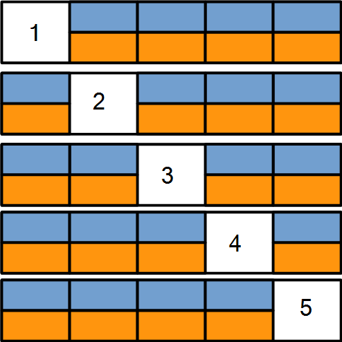

```{r setup, include=FALSE}
knitr::opts_chunk$set(echo = TRUE, warning = FALSE, message = FALSE)
```

## Introduction
In [Part 3](http://rpubs.com/mszczepaniak/predictkbo3model), we built the model used to make predictions, but we had arbitrarily chosen values for the two parameters in the model which were the discount rates at the bigram and trigram levels: $\gamma_2$ and $\gamma_3$.  In the final installment of this 4-part series, we'll determine good values for these discount rates using 5-fold cross-validation on the training partitions of the Blogs corpus.  After selecting the best looking values, we'll conclude the analysis with an accuracy estimate using the held out test set.

## K-Fold Cross-Validation
In their book [*An Introduction to Statistical Learning* [1]](http://www-bcf.usc.edu/~gareth/ISL/) James, Witten, Hastie, and Tibshirani describe K-Fold Cross-Validation as follows:

*This approach involves randomly dividing the set of observations into k groups, or **folds** of approximately equal size.  The first fold is treated as a validation set, and the method is fit on the remaining k - 1 folds.*  

A good way to start understanding this approach is to first visualize breaking the data into k roughly equal partitions.  In our case k=5, so we can use the picture below to illustrate the process.  



### Cross-Validation Alogrithm
The following procedure was followed: Start by creating each of the 5 folds using the **makeFolds** function.  Note all code referred to in this document will are listed in the **Appendix** unless described otherwise.  In each fold there are 3 partitions.  The first partion is the **validation set** shown as the white box (20% of the overall data).  The remaining data is partitioned into two groups: 1) the **training set** (80% of remaining non-validation data) shown as the blue boxes and 2) the **test set** (20% of remaining non-validation data) shown as the gold boxes.  The blue data is used to build the model which in addition to the algorithm described in [Part 3](http://rpubs.com/mszczepaniak/predictkbo3model), consists of three n-gram tables: a unigram table, a bigram table, and a trigram table which were created using the **makeFoldNgramTables** function.  We also need to specify two parameters: a bigram discount rate, and a trigram discount rate.  These were the $\gamma_2$ and $\gamma_3$ variables described in [Part 3](http://rpubs.com/mszczepaniak/predictkbo3model).

Using all the data shown in blue, we build the n-gram tables.  Then, for each pair of designated discount rates, we select a random trigrams from the gold data, split out the bigram consisting of the first two words (aka bigram prefix), and use this bigram to predict the last word of the original trigram (aka trigram tail).  If the predicted word matches the trigram tail, it's considered a correct prediction.

During this process, we keep track of the number of correct predictions and calculate a training accuracy rate for each pair of bigram and trigram discount rates.  We then select that best bigram/trigram discount rate pair and use it on the validation set (designated in white) to get an estimate for the true (test set) accuracy.

We then repeat these steps holding out partion 2 as the validation set, rebuild the model from the blue data, test against the gold, select the best discount rate pair and use this to predict that validation set.  After completing the process on the fifth and last partion.  The discounts the gave the highest test set accuracy was selected.

### References
[1] An Introduction to Statistical Learning -  
[http://www-bcf.usc.edu/~gareth/ISL/](http://www-bcf.usc.edu/~gareth/ISL/)  
[2] Trevor Hastie & Rob Tibshirani on Cross-Validation (part 1) -  
[https://www.youtube.com/watch?v=_2ij6eaaSl0](https://www.youtube.com/watch?v=_2ij6eaaSl0)  
[3] Trevor Hastie & Rob Tibshirani on K-Fold Cross-Validation (part 2) -  
[https://www.youtube.com/watch?v=nZAM5OXrktY](https://www.youtube.com/watch?v=nZAM5OXrktY)  
[4] Trevor Hastie & Rob Tibshirani on Right & Wrong Ways to do CV (part 3) -  
[https://www.youtube.com/watch?v=S06JpVoNaA0](https://www.youtube.com/watch?v=S06JpVoNaA0)

### Appendix

```{r eval=FALSE}
## Returns a list with nfolds items. Each list contains the indices for the 
## data in each fold. Indices are then written to files: one set of indices
## per fold.
## 
## indices_count - int that are the number of items to take a sample from. If
##                 sample data is a data frame, this is typically nrows(data).
## nfolds - number of folds in the data to make
## write_folds - TRUE if indices for each fold should be written to files
## fold_indices_file_prefix - start of the output file name
## fold_indices_file_postfix - end of the output file name
## out_dir - directory to write the output files if write_folds == TRUE
## seed_value - seed value for random selects, set for reproducibility
makeFolds <- function(indices_count, nfolds=5, write_folds=TRUE,
                      fold_indices_file_prefix="fold_",
                      fold_indices_file_postfix="blogs",
                      fold_indices_file_ext=".txt",
                      out_dir="./", seed_value=719) {
    set.seed(seed_value)
    folds <- vector("list", nfolds)
    inds <- 1:indices_count
    min_per_fold <- length(inds) / nfolds # min # of samples in each fold
    for(i in 1:nfolds) {
        samp_inds = sample(inds, min_per_fold) # get indices for fold
        folds[[i]] <- samp_inds
        inds <- setdiff(inds, samp_inds) # remaining after taking for fold
        if(i == nfolds) {
            cat("there are ", length(inds), "remaining samples to distribute.\n")
            for(j in 1:length(inds)) {
                samp <- sample(inds, 1)
                folds[[j]] <- c(folds[[j]], samp)
                inds <- setdiff(inds, samp)
            }
        }
    }
    # write out the indices in each fold
    if(write_folds) {
        for(k in 1:nfolds) {
            out_file <- sprintf("%s%s%s%s", fold_indices_file_prefix, k,
                                fold_indices_file_postfix,
                                fold_indices_file_ext)
            out_file <- sprintf("%s%s", out_dir, out_file)
            write.table(folds[[k]], out_file, quote=FALSE, sep="\n",
                        row.names=FALSE, col.names=FALSE)
            cat("Finished writing", out_file, "\n")
        }
    }
    
    return(folds)
}
```
```{r eval=FALSE}
if(!exists('fold_paths')) {
    # Note: These files need to be generated from the makeFolds function in KboCv.R
    blogs_paths <- c("https://www.dropbox.com/s/fo7ybvw4h7de2e8/fold_1blogs.txt?dl=1",
                     "https://www.dropbox.com/s/ufnm970okjwqi7j/fold_2blogs.txt?dl=1",
                     "https://www.dropbox.com/s/lzbg2zuixhcwzev/fold_3blogs.txt?dl=1",
                     "https://www.dropbox.com/s/cxt7bmjd5qebhkr/fold_4blogs.txt?dl=1",
                     "https://www.dropbox.com/s/cl3ifhr5hjercuy/fold_5blogs.txt?dl=1")
    news_paths <- c("https://www.dropbox.com/tdb",
                    "https://www.dropbox.com/tdb",
                    "https://www.dropbox.com/tdb",
                    "https://www.dropbox.com/tdb",
                    "https://www.dropbox.com/tdb")
    twitr_paths <- c("https://www.dropbox.com/tdb",
                     "https://www.dropbox.com/tdb",
                     "https://www.dropbox.com/tdb",
                     "https://www.dropbox.com/tdb",
                     "https://www.dropbox.com/tdb")
    fold_paths <- data.frame(blogs=blogs_paths, news=news_paths,
                             twitter=twitr_paths, stringsAsFactors = FALSE)
}

if(!exists('default_folds')) {
    cat("reading fold data...\n")
    default_folds <- readFolds(fold_paths)
}

if(!exists('corpus_urls')) {
    rm(list = ls())
    corpus_urls <- c("https://www.dropbox.com/s/9dx3oo1w5uf8n1t/en_US.blogs.train.8posteos.txt?dl=1",
                     "https://www.dropbox.com/s/54cvi36161y6pvk/en_US.news.train.8posteos.txt?dl=1",
                     "https://www.dropbox.com/s/6ayhavfnzs5lmqa/en_US.twitter.train.8posteos.txt?dl=1")
    names(corpus_urls) <- c("blogs", "news", "twitter")
}

## Reads in the training set, creates the 1 thru n-gram frequency tables and
## writes them out to files.
## corp_data - 2 col dataframe: 1st column, ctype are the corpora type
##                              2nd column, corp_urls are the urls for the
##                                          data of each corpora type
## ng - int vector specifying the n-grams to be created
## folds - list of int lists which are the output of the readFolds function
## cv_dir - directory to find cv fold indices data and where n-gram tables
##          are written to
## ofile_prefix - prefix of output file names
## ofile_postfix - postfix of output file names
makeFoldNgramTables <- function(corp_data=
                                data.frame(ctype=c("blogs", "news", "twitter"),
                                           corp_url=corpus_urls),
                                ng=1:3, folds=default_folds,
              cv_dir="D:/Dropbox/sw_dev/projects/PredictNextKBO/cv/",
              ofile_prefix="fold_", ofile_postfix="grams.csv") {
    for(c in 1:nrow(corp_data)) {
        corpus_type <- corp_data$ctype[c]
        corp_url <- corp_data$corp_url[c]
        corp_lines <- read_lines(corp_url)
        for(fold in 1:(length(folds)-1)) {
            train_fold_path <- sprintf("%s%s%s%s%s%s", cv_dir, "fold_", fold,
                                       "train_", corpus_type, ".txt")
            train_fold_indices <- read.table(train_fold_path, sep = "\n")$V1
            train_fold <- corp_lines[train_fold_indices]
            for(g in ng) {
                fname <- sprintf("%s%s%s%s%s%s%s", ofile_prefix, fold,
                                 "train_", corpus_type, "_", g, ofile_postfix)
                fpath <- sprintf("%s%s", cv_dir, fname)
                cat("Start table", fname, "building @ time:",
                    as.character(Sys.time()), "\n")
                ngram_table <- getNgramTables(g, train_fold)
                ngram_table <- filter(ngram_table, freq > 1) # remove singletons
                write.csv(ngram_table, fpath, row.names = FALSE)
                cat("Finish table", fpath, "write @ time:",
                    as.character(Sys.time()), "\n")
            }
        }
    }
}
```

